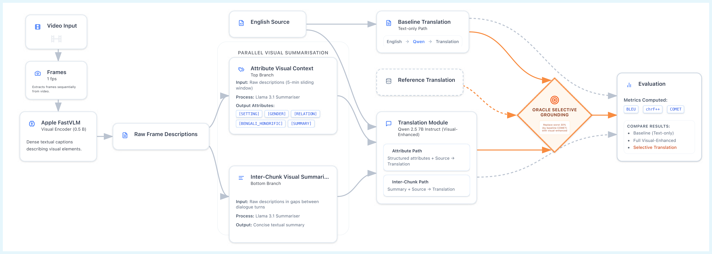

# Visually-Guided Subtitle Translation 🧠👁️

[](https://www.python.org/)
[](https://pytorch.org/)
[](https://developer.nvidia.com/cuda-downloads)

Translates **English movie subtitles** to **Indian languages** (Bengali, Hindi, Telugu, Kannada, Tamil) using **visual context** from video frames. Achieves superior performance over text-only baselines through **selective grounding**.

## 🎯 Key Features
- **Visual Descriptions**: Frame-by-frame analysis using **FastVLM**.
- **Context-Aware Translation**: Qwen2.5 + 5-min sliding window attributes or inter-dialogue summaries.
- **Selective Fusion**: Replace only the worst ~30% baseline segments with visual-enhanced ones.
- **Evaluation**: BLEU, chrF++, COMET (WMT22-da) across 20 movie-language pairs.
- **Sample Data**: Ready-to-run corpora for 4 movies × 5 languages.

## 📊 Pipeline Overview




## 🛠️ Prerequisites
- Python 3.10+, CUDA 12+ (for GPU acceleration)
- ~16GB VRAM for Qwen2.5-7B / Llama-3.1-8B
- Install: `pip install -r requirements.txt`

**Note**: First run downloads models (~30GB total).

## 🚀 Quick Start (Full Pipeline)
Process **Titanic** to **Bengali**:

```bash
# 1. Extract visuals (1fps, ~2hr movie takes 30-60min GPU)
python extract_visuals.py titanic.mp4 -o titanic_descriptions.log

# 2. Baseline (text-only)
python translate_baseline.py data/sample/Bengali/Titanic_en_bn_corpus.csv --movie Titanic --langs bengali --output_dir baseline/

# 3. Visual context (attribute method)
python summarise_visuals.py Titanic --lang bengali --method attr --visuals titanic_descriptions.log --subtitles data/sample/Bengali/Titanic_en_bn_corpus.csv

# 4. Visual translation
python translate_visual.py Titanic_bengali_attr_context.csv --movie Titanic --langs bengali --output_dir visual/

# 5. Selective grounding (30% worst replaced)
python selective_grounding.py baseline/Titanic_baseline_predicted.csv visual/Titanic_multilingual_predicted.csv --output_dir selective/ --lang bengali --percentile 30

# 6. Evaluate
python evaluate.py --input_dir selective/ --output_csv metrics.csv --languages bengali
```

## 🧪 Individual Scripts

### 1. `extract_visuals.py`
```bash
python extract_visuals.py movie.mp4 --output movie_descriptions.log --sample-rate 1
```

### 2. `summarise_visuals.py`
Two modes:
```bash
# Attributes (gender, setting, honorifics)
python summarise_visuals.py Movie --lang bengali --method attr --visuals movie_descriptions.log --subtitles data/sample/Bengali/Movie_en_bn_corpus.csv

# Gap summaries (inter-dialogue)
python summarise_visuals.py Movie --lang bengali --method gap --visuals movie_descriptions.log --subtitles data/sample/Bengali/Movie_en_bn_corpus.csv
```

### 3. `translate_baseline.py` / `translate_visual.py`
Multi-language:
```bash
python translate_visual.py input_context.csv --movie Movie --langs bengali telugu hindi --test  # First 10 rows
```

### 4. `selective_grounding.py`
```bash
python selective_grounding.py baseline.csv visual.csv --output_dir selective/ --lang bengali --percentile 30 --metric comet
```

### 5. `evaluate.py`
Batch:
```bash
python evaluate.py --input_dir predictions/ --output_csv metrics.csv --pattern '*predicted*.csv'
```

## 📁 Data Format
**Input Corpus** (`data/sample/Bengali/Titanic_en_bn_corpus.csv`):
```
timeline,en_dialogue,bengali_target
00:00:01,000 --> 00:00:02,000,\"I'm the king of the world!\",\"আমি বিশ্বের রাজা!\"
```

**Predictions**:
```
timeline,en_dialogue,predicted_bengali,actual_bengali
...
```

## ⚠️ Limitations
- Requires aligned timestamps + reference translations.
- Heavy compute (GPU essential for production).
- Tested on Hollywood movies; domain-specific fine-tuning advised.

## 🤝 Contributing
1. Fork & PR improvements (e.g., new languages, models).
2. Add your metrics to the results table!

## 📄 License
MIT License - see [LICENSE](LICENSE).
```


